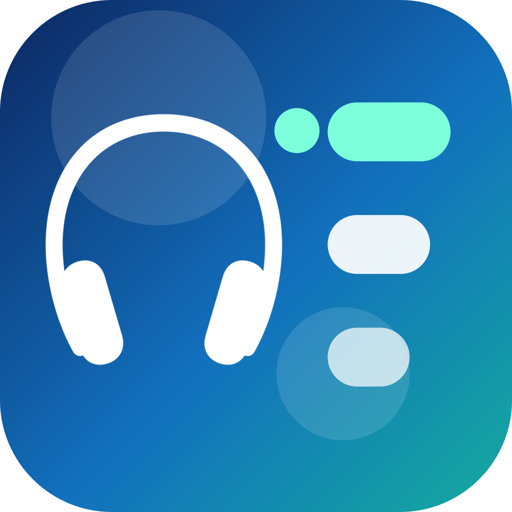
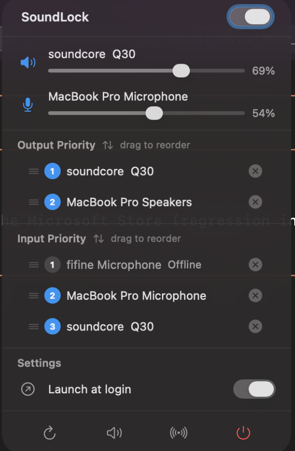

<p align="center">
  
</p>

<h1 align="center">SoundLock</h1>

<p align="center"><strong>Your audio. Your rules. Always.</strong></p>

<p align="center">
  A lightweight macOS menu bar app that stops the system from hijacking your audio devices.
</p>

<p align="center">
  <a href="https://mancan.digital/products/soundlock.html"><strong>Website</strong></a> ·
  <a href="https://github.com/lucasmancan/SoundLock/releases/latest"><strong>Download</strong></a> ·
  <a href="https://mancan.digital/products/soundlock.html"><strong>Buy a license</strong></a>
</p>

<p align="center">
  
</p>

---

> **A product by [mancan.digital](https://mancan.digital).** This repository is the public
> home for SoundLock — downloads, release notes, and support. The source code is proprietary
> and not distributed here.

---

## The problem with macOS audio

macOS decides which audio device to use, and it changes its mind constantly.

Connect a pair of Bluetooth headphones and macOS switches your output to them — even if you were mid-call on your AirPods. Plug in a USB hub with an audio chip and suddenly your mic is gone. Open a video call and the system reassigns your input without asking. Every time a new device appears, macOS picks a winner based on its own rules, not yours.

The System Settings audio panel lets you change the default device after the fact, but it won't remember your preference the next time things connect or disconnect. There's no concept of priority. There's no lock. There's no protection.

So you fix it manually. And then you fix it again. And again.

---

## What SoundLock does differently

SoundLock puts you in charge of a ranked priority list — one for output devices, one for input — and keeps the system honest.

**It's always watching.** Three CoreAudio listeners run silently in the background, watching for default-device changes, new connections, and disconnections. The moment macOS switches to the wrong device, SoundLock switches it back.

**It uses your priority list, not macOS's.** You drag your preferred headphones to the top. If they're connected, they stay active. If they disconnect, SoundLock promotes the next device on your list automatically. When the top-priority device reconnects, it takes over again.

**It remembers devices even when they're offline.** Your AirPods in the priority list but not currently connected? They stay in the list, labelled Offline, ready to take priority the moment they pair.

**It recovers from Bluetooth delays.** macOS often auto-switches audio after a Bluetooth device finishes pairing — a delayed second event that happens 1–3 seconds after connection. SoundLock schedules multiple recovery checks to catch this, and cancels stale ones if a newer event arrives.

**It respects when you want to opt out.** The guard toggle in the menu lets you temporarily disable priority enforcement — useful when you deliberately want to try a different device. Toggle it back on and SoundLock immediately reasserts your priority.

---

## Features

- **Priority output and input lists** — drag to reorder, add/remove any connected physical device
- **Offline device persistence** — priority devices stay in the list even when disconnected
- **Volume control** — slider and percentage display for both output and input priority devices
- **Mute toggles** — one-tap mute for both directions, directly from the menu
- **Guard toggle** — enable or disable priority enforcement instantly from the menu bar
- **Launch at login** — runs silently in the background from the moment you log in
- **Zero Dock presence** — lives entirely in the menu bar, takes no space in your app switcher
- **System Settings shortcuts** — one-click access to Sound and Bluetooth panels from the footer
- **Tiny footprint** — event-driven CoreAudio listeners with 0% idle CPU and minimal RAM usage

---

## How it compares to macOS defaults

| | macOS | SoundLock |
|---|---|---|
| Remembers preferred device | ✗ | ✓ |
| Priority order across devices | ✗ | ✓ |
| Auto-restores on reconnect | ✗ | ✓ |
| Recovers from BT pairing delay | ✗ | ✓ |
| Volume control in menu bar | ✓ (system menu only) | ✓ |
| Runs silently in background | — | ✓ |
| No Dock icon | — | ✓ |

---

## Privacy

SoundLock knows nothing about you. There is no account, no telemetry, no analytics, no network code of any kind. The app never leaves your Mac.

**It never listens to your audio.** SoundLock does not record, sample, or process any audio data. It uses CoreAudio's Hardware Abstraction Layer (HAL) exclusively — the same low-level API that macOS itself uses to route audio. It sets device metadata (which device is the default, its volume level, its mute state). It reads zero bytes of audio content.

**It does not need microphone permission.** macOS requires microphone access when an app reads audio stream data. SoundLock never opens an audio stream, so the permission prompt never appears and the entitlement is never requested. You can verify this: open System Settings → Privacy & Security → Microphone — SoundLock will not appear in the list.

**No accessibility, location, or any other sensitive permission is used.** The only system feature SoundLock opts into is Launch at Login, which is handled through a standard macOS API (`SMAppService`) and clearly indicated by a toggle in the UI.

**All preferences stay on your device.** Your priority device lists are stored in `~/Library/Preferences/` via standard `UserDefaults`, the same place macOS stores every app's settings. Nothing is synced, shared, or uploaded.

---

## Performance

SoundLock is built around a single principle: do nothing unless the system tells you something changed.

**0% CPU at idle.** No polling loop, no timer, no background thread spinning. The app registers three CoreAudio property listeners and then goes completely dormant. The CPU wakes only when macOS fires one of those events — a device connects, disconnects, or the default changes.

**Minimal RAM.** The entire app runs comfortably under 20 MB. No image caches, no web views, no large frameworks loaded.

---

## Requirements

- macOS 13 (Ventura) or later
- Apple Silicon or Intel

---

## Install

1. Download the latest build from the [releases page](https://github.com/lucasmancan/SoundLock/releases/latest).
2. Unzip and drag `SoundLock.app` to `/Applications`.
3. Launch it, enable **Launch at login**, and forget about it.

### First launch — approving the app

This build is not yet notarized by Apple, so macOS Gatekeeper blocks it on first
launch with a *"cannot be opened"* or *"is damaged"* warning. This is expected — the
app is safe (it ships no network code; see [Privacy](#privacy)). Approve it **once**
and macOS remembers it forever:

**macOS 14 Sonoma and earlier**
- Right-click (or Control-click) `SoundLock.app` → **Open** → **Open** in the dialog.

**macOS 15 Sequoia and later**
1. Double-click `SoundLock.app` once (the warning appears — dismiss it).
2. Open **System Settings → Privacy & Security**.
3. Scroll to the Security section — you'll see *"SoundLock was blocked"* → click **Open Anyway**.
4. Confirm with Touch ID or your password.

**Terminal (any macOS, fastest)**
```bash
xattr -dr com.apple.quarantine /Applications/SoundLock.app
```
Then open the app normally.

---

## Pricing & license

SoundLock is a commercial product. See [mancan.digital/products/soundlock.html](https://mancan.digital/products/soundlock.html) for current pricing and to purchase a license.

Downloading the app constitutes acceptance of the [End-User License Agreement](./LICENSE.txt). The software is proprietary — all rights reserved.

---

## Support

Questions, bug reports, or license issues: open an [issue](https://github.com/lucasmancan/SoundLock/issues) or reach out via [mancan.digital](https://mancan.digital).

---

<p align="center">© 2026 mancan.digital · All rights reserved.</p>
